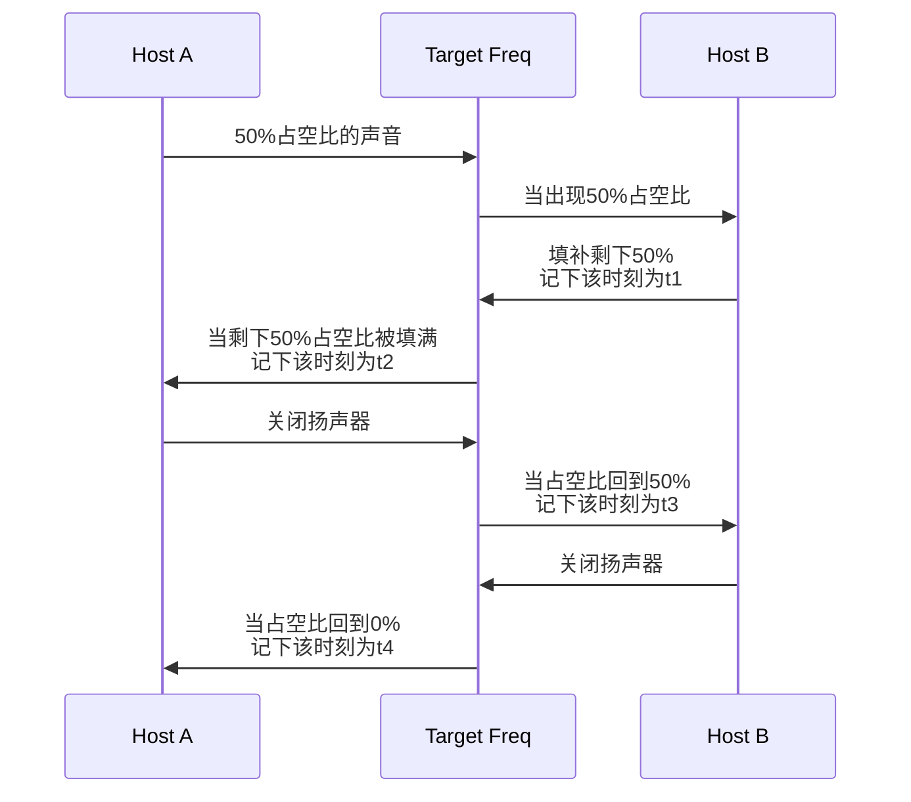
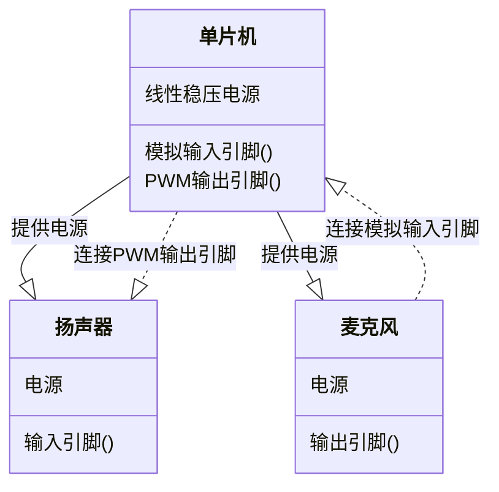
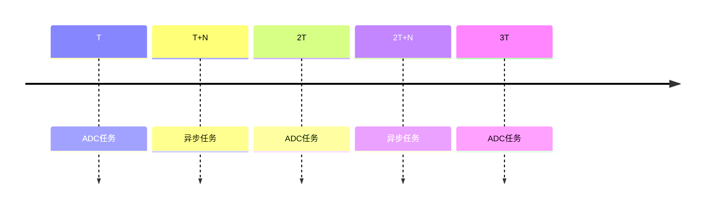
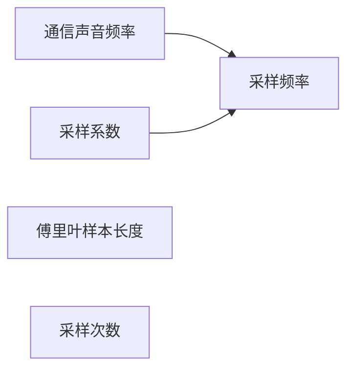

# 基于`ESP32C3`单片机的回声测距验证实验

## 前言

本项目是叶正楠由于个人原因用于抵扣在大二下学期的通信实习。题目来自我所在的大创项目的一个验证工作。本报告使用`rust`对`esp32c3`进行编程。现有的声学测距基本使用麦克风阵列与FPGA作为硬件，主要关注主机与静物或是不可控声源的实现。本项目旨在验证除以上条件之外的声学测距方案，实现两设备使用扬声器麦克风实现测距。

## 实验介绍

实验旨在分析使用声波进行测距的可行性。设想的情况下，有两台设备搭载扬声器和麦克风，以此代替电磁波中的接收天线与发射天线。两者的扬声器会发出相同频率的声音。配合麦克风，两个设备可以完成以下流程：（图中的Host A/B表示两设备，Target Freq表示空间中特定频率声波的振幅，可以看作一个信道）

 图2.1 通信流程图

以上流程完成后，两设备得到两个时间戳，可以认为存在如下关系：
$$
A得到的距离=(t_2-t_4)\times v_{声速}\\
B得到的距离=(t_1-t_3)\times v_{声速}
$$
本实验将根据以上流程设计一套硬件模拟该通信流程，分析该方案的可行性。

## 硬件结构

我搭建的硬件结构非常简单，关系如下图所示：

图3.1 硬件结构

所有部件在淘宝上采购，其中单片机选择合宙的`esp32c3`开发板，扬声器使用可以调频的蜂鸣器代替，麦克风模块使用片载`MAX4466`，一个创建的麦克风前置放大器。

图3.2 使用的单片机

图3.3 使用的扬声器，用可调频蜂鸣器代替

图3.4 使用的麦克风，片载麦克风专用放大器

将三者按照图3.1在面包被板上连接，实物如图所示：

图3.5 拼接完成的硬件

### 遇到的问题

在完成实验后，我认为硬件上有这么几点值得改进：

#### 使用独立的ADC模块

实际上这是ESP32C3的问题，官方宣称ADC模块的采样频率可以达到1MHz。但我在实际使用中发现CPU很大程度上被ADC任务占满了，当然我没有使用idf进行编程，占空率通过时钟终端之间的片上时间戳计算得出。相比其他单片机，esp32c3可能需要更多的编程优化。相关issue链接如下：

1. https://github.com/espressif/esp-idf/issues/10058#issuecomment-1296726328

#### 使用高频麦克风代替蜂鸣器

假如使用了外置的ADC那么ADC转换速度就可以保证。现在使用的声音频率为5kHz。我在采购的时候虽然没有预料到ADC的问题，我选择这个频率的原因有二：

一是高频衰减非常严重。我使用我的笔记本和搭建完成的硬件进行测试，5kHz下步测距离约为20米，以下是0米和20米的声波频谱：

二是扬声器，淘宝上大部分的扬声器模块基本围绕人耳范围设计。大部分模块的放大器高频截止在15kHz，高频截止在20kHz的大部分只有放大器，选择这类模块需要另外考虑喇叭。这又是一些选型的工作。出于时间安排原因我还是选择降低声音频率，其实这可以说部分降低了难度。当应当不影响证明该方案不具备实用性。当然，这也证明了假如有更多时间和预算，我们可能可以得到更好的结果。

## 软件设计

首先，本项目对软件提出了以下需求：

* 驱动麦克风
* 计算`rfft`（真实离散傅里叶）
* 根据通信步骤设计的状态机
* 驱动扬声器

满足以上需求，需要使用以下硬件资源：

* 两个定时器组（`TIMG`）
* `LEDC`（`PWM`）
* `ADC`

定时器决定了软件运行的调度策略，`esp32c3`中一般使用定时器组作为时钟中断，在`esp-hal`更新到0.19.0后，可以将时钟设置为周期模式和脉冲模式（单次定时触发）。我选择使用`TIMG1`作为周期时钟单独运行ADC任务给离散傅里叶变换提供时间序列。使用`TIMG0`作为异步运行时提供多线程接口。设置周期时钟中断为高优先级后，以中断为界就可以得到一个一个时间片。

### 调度设计

图4.1 cpu任务调度示意图

在非`rust`的嵌入式开发中，经常强调使用RTOS。RTOS（包括嵌入式linux+运行时补丁和一般而言的单片机操作系统）的原理是在正常的调度中，增加很多任务抢占点，一般使用绝对公平调度算法完成调度，极大减少线程被饿死的情况。`rust`在一般的操作系统编程中使用异步运行时作为密集IO任务的首选。原理是改变了非cpu任务的处理方式，以磁盘IO任务为例：

 每个IO任务被抽象为一个poll任务，存放在异步运行时的调度栈中。相对于RTOS的调度策略，这种设计将抢占点的设置交换给了开发人员，可以对调度进行更细致的配置。`rust`异步的另一个优化点是对上下文的处理方式，`rust`的变量大部分是一个被称为引用的指针，指针存放在栈上提供快速的上下文切换；数据存放在堆上，提供动态分配功能。异步任务退出poll()后，编译器会让上下文中所有变量在堆上的地址保持不变。以便于下一次使用。一定程度上，则会影响其他需要动态内存分配的任务，但假如不这样做，异步中的上下文切换开销会非常恐怖。一般需要在异步运行时开始前尽可能的完成动态内存分配任务或是提前将异步任务上下文中的变量变为静态生命周期。

异步操作和中断任务很像，但在编程特别是嵌入式编程中一个很不同的点是参数传递。中断函数的上下文几乎独立与入口进程。假如想向其中传递参数一般使用静态变量。这种方法的问题就是假如中断任务稍微复杂一点，就需要维护大量的静态变量。但异步任务的初始化一般使用函数或者闭包，两者都是安全（生命周期连续）的对象转移方式。

### 物理参数设计

软件运行开始前，需要计算大量物理参数，其依赖关系如下图所示：

