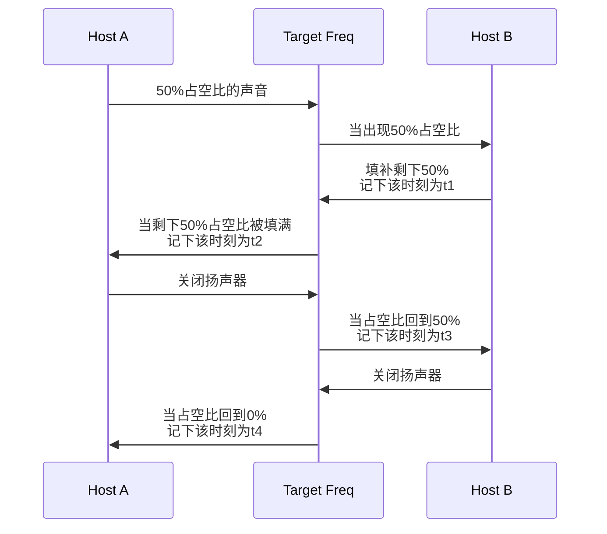
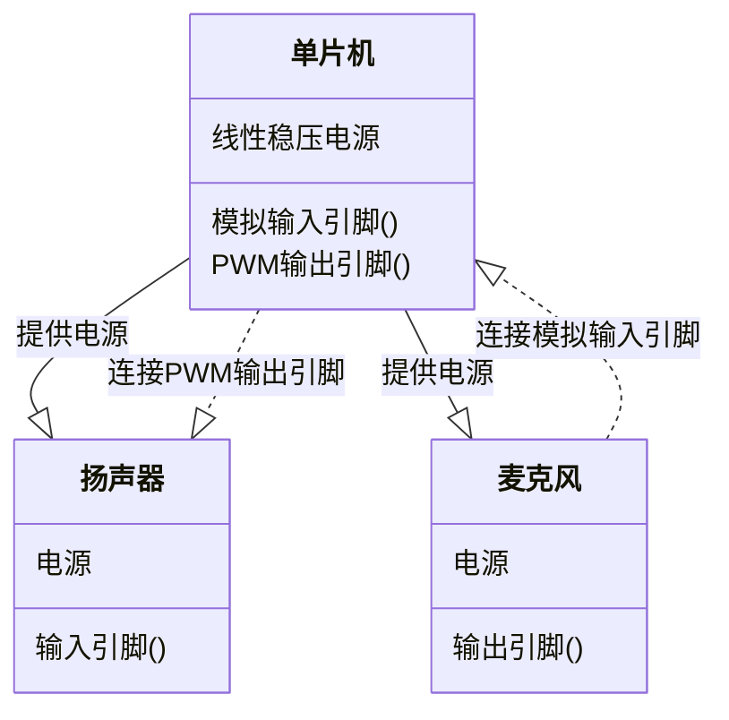

# 基于`ESP32C3`单片机的回声测距验证实验

## 前言

本项目是叶正楠由于个人原因用于抵扣在大二下学期的通信实习。题目来自我所在的大创项目的一个验证工作。本报告使用`rust`对`esp32c3`进行编程。现有的声学测距基本使用麦克风阵列与FPGA作为硬件，主要关注主机与静物或是不可控声源的实现。本项目旨在验证除以上条件之外的声学测距方案，实现两设备使用扬声器麦克风实现测距。

## 实验介绍

实验旨在分析使用声波进行测距的可行性。设想的情况下，有两台设备搭载扬声器和麦克风，以此代替电磁波中的接收天线与发射天线。两者的扬声器会发出相同频率的声音。配合麦克风，两个设备可以完成以下流程：（图中的Host A/B表示两设备，Target Freq表示空间中特定频率声波的振幅，可以看作一个信道）

 图2.1 通信流程图

以上流程完成后，两设备得到两个时间戳，可以认为存在如下关系：
$$
A得到的距离=(t_2-t_4)\times v_{声速}\\
B得到的距离=(t_1-t_3)\times v_{声速}
$$
本实验将根据以上流程设计一套硬件模拟该通信流程，分析该方案的可行性。

## 硬件结构

我搭建的硬件结构非常简单，关系如下图所示：

图3.1 硬件结构

所有部件在淘宝上采购，其中单片机选择合宙的`esp32c3`开发板，扬声器使用可以调频的蜂鸣器代替，麦克风模块使用片载`MAX4466`，一个创建的麦克风前置放大器。

图3.2 使用的单片机

图3.3 使用的扬声器，用可调频蜂鸣器代替

图3.4 使用的麦克风，片载麦克风专用放大器

将三者按照图3.1在面包被板上连接，实物如图所示：

图3.5 拼接完成的硬件

### 遇到的问题

在完成实验后，我认为硬件上有这么几点值得改进：

#### 使用独立的ADC模块

实际上这是ESP32C3的问题，官方宣称ADC模块的采样频率可以达到1MHz。但我在实际使用中发现CPU很大程度上被ADC任务占满了，当然我没有使用idf进行编程，占空率通过时钟终端之间的片上时间戳计算得出。相比其他单片机，esp32c3可能需要更多的编程优化。相关issue链接如下：

1. https://github.com/espressif/esp-idf/issues/10058#issuecomment-1296726328

#### 使用高频麦克风代替蜂鸣器

假如使用了外置的ADC那么ADC转换速度就可以保证。现在使用的声音频率为5kHz。我在采购的时候虽然没有预料到ADC的问题，我选择这个频率的原因有二：

一是高频衰减非常严重。我使用我的笔记本和搭建完成的硬件进行测试，5kHz下步测距离约为20米，以下是0米和20米的声波频谱：

二是扬声器，淘宝上大部分的扬声器模块基本围绕人耳范围设计。大部分模块的放大器高频截止在15kHz，高频截止在20kHz的大部分只有放大器，选择这类模块需要另外考虑喇叭。这又是一些选型的工作。出于时间安排原因我还是选择降低声音频率，其实这可以说部分降低了难度。当应当不影响证明该方案不具备实用性。当然，这也证明了假如有更多时间和预算，我们可能可以得到更好的结果。

## 软件设计

单片机的软件设计需要基于硬件资源，在本项目中，主要使用以下资源
