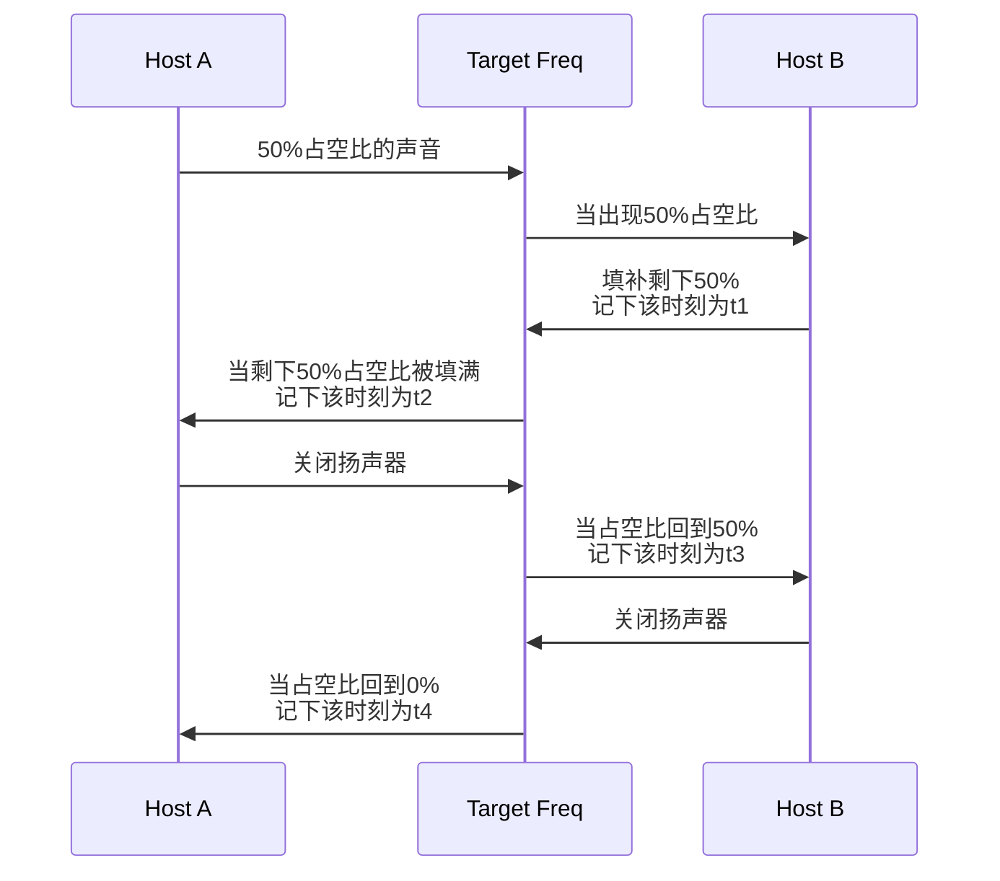
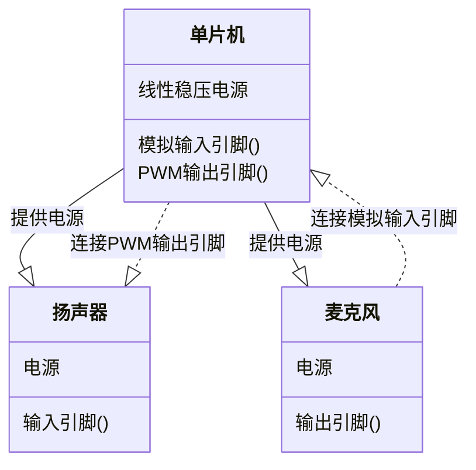
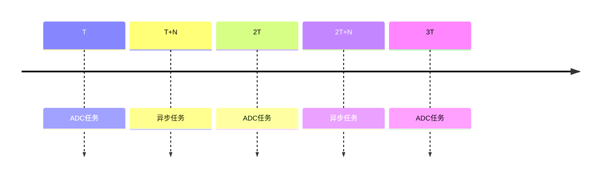
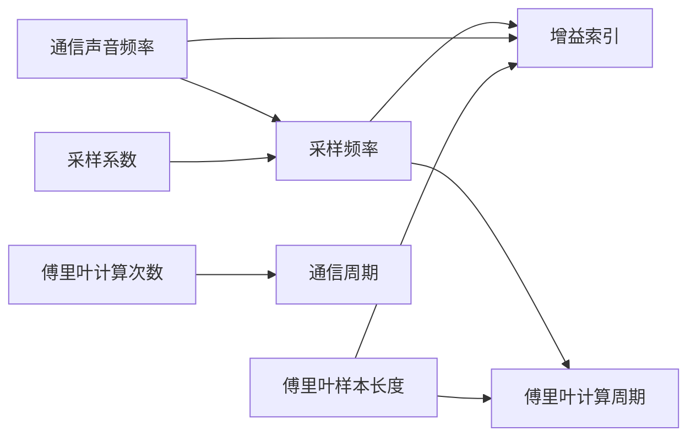
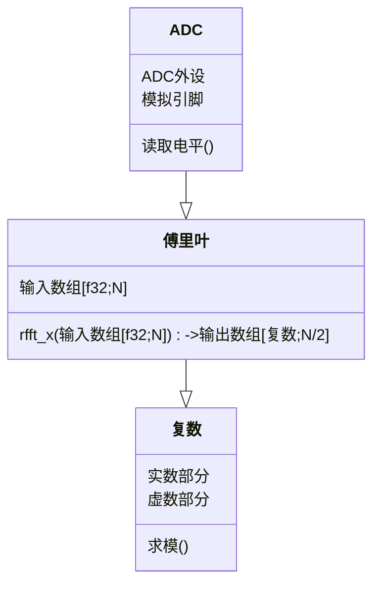

# 基于`ESP32C3`单片机的回声测距验证实验

## 前言

本项目是叶正楠由于个人原因用于抵扣在大二下学期的通信实习。题目来自我所在的大创项目的一个验证工作。本报告使用`rust`对`esp32c3`进行编程。现有的声学测距基本使用麦克风阵列与`FPGA`作为硬件，主要关注主机与静物或是不可控声源的实现。本项目旨在验证除以上条件之外的声学测距方案，实现两设备使用扬声器麦克风实现测距。

## 实验介绍

实验旨在分析使用声波进行测距的可行性。设想的情况下，有两台设备搭载扬声器和麦克风，以此代替电磁波中的接收天线与发射天线。两者的扬声器会发出相同频率的声音。配合麦克风，两个设备可以完成以下流程：（图中的`Host A/B`表示两设备，`Target Freq`表示空间中特定频率声波的振幅，可以看作一个信道）



<center> 图2.1 通信流程图</center>

<div style="page-break-after: always;"></div>

以上流程完成后，两设备得到两个时间戳，可以认为存在如下关系：
$$
A得到的距离=(t_2-t_4)\times v_{声速}\\
B得到的距离=(t_1-t_3)\times v_{声速}
$$
本实验将根据以上流程设计一套硬件模拟该通信流程，分析该方案的可行性。

## 硬件结构

我搭建的硬件结构非常简单，关系如下图所示：



<center>图3.1 硬件结构</center>

所有部件在淘宝上采购，其中单片机选择合宙的`esp32c3`开发板，扬声器使用可以调频的蜂鸣器代替，麦克风模块使用片载`MAX4466`，一个常用的麦克风前置放大器。


<center>图3.2 使用的单片机</center>


<center>图3.3 使用的扬声器，用可调频蜂鸣器代替</center>


<center>图3.4 使用的麦克风，片载麦克风专用放大器</center>

将三者按照图3.1在面包被板上连接，实物如图所示：


<center>图3.5 拼接完成的硬件</center>

### 遇到的问题

在完成实验后，我认为硬件上有这么几点值得改进：

#### 使用独立的ADC模块

实际上这是`esp32c3`的问题，官方宣称ADC模块的采样频率可以达到`1MHz`。但我在实际使用中发现CPU很大程度上被ADC任务占满了，当然我没有使用`idf`进行编程，占空率通过时钟终端之间的片上时间戳计算得出。相比其他单片机，`esp32c3`可能需要更多的编程优化。相关issue链接如下：

1. https://github.com/espressif/esp-idf/issues/10058#issuecomment-1296726328

#### 使用高频麦克风代替蜂鸣器

假如使用了外置的ADC那么ADC转换速度就可以保证。现在使用的声音频率为`5kHz`。我在采购的时候虽然没有预料到ADC的问题，我选择这个频率的原因有二：

一是高频衰减非常严重。我使用我的笔记本和搭建完成的硬件进行测试，`5kHz`下步测距离约为20米，以下是0米和20米的声波频谱：

二是扬声器，淘宝上大部分的扬声器模块基本围绕人耳范围设计。大部分模块的放大器高频截止在`15kHz`，高频截止在`20kHz`的大部分只有放大器，选择这类模块需要另外考虑喇叭。这又是一些选型的工作。出于时间安排原因我还是选择降低声音频率，其实这可以说部分降低了难度。当应当不影响证明该方案不具备实用性。当然，这也证明了假如有更多时间和预算，我们可能可以得到更好的结果。

## 软件设计

首先，本项目对软件提出了以下需求：

* 驱动麦克风
* 计算`rfft`（真实离散傅里叶）
* 根据通信步骤设计的状态机
* 驱动扬声器

满足以上需求，需要使用以下硬件资源：

* 两个定时器组（`TIMG`）
* `LEDC`（`PWM`）
* `ADC`

定时器决定了软件运行的调度策略，`esp32c3`中一般使用定时器组作为时钟中断，在`esp-hal`更新到0.19.0后，可以将时钟设置为周期模式和脉冲模式（单次定时触发）。我选择使用`TIMG1`作为周期时钟单独运行ADC任务给离散傅里叶变换提供时间序列。使用`TIMG0`作为异步运行时提供多线程接口。设置周期时钟中断为高优先级后，以中断为界就可以得到一个一个时间片。

### 调度设计



<center>图4.1 cpu任务调度示意图</center>

在非`rust`的嵌入式开发中，经常强调使用`RTOS`。`RTOS`（包括嵌入式`linux`+运行时补丁和一般而言的单片机操作系统）的原理是在正常的调度中，增加很多任务抢占点，一般使用绝对公平调度算法完成调度，极大减少线程被饿死的情况。`rust`在一般的操作系统编程中使用异步运行时作为密集IO任务的首选。原理是改变了非CPU密集任务的处理方式，以磁盘IO任务为例：


<center>图4.2 rust异步调度状态机</center> 

每个IO任务被抽象为一个poll任务，存放在异步运行时的调度栈中。相对于`RTOS`的调度策略，这种设计将抢占点的设置交换给了开发人员，可以对调度进行更细致的配置。`rust`异步的另一个优化点是对上下文的处理方式，`rust`的变量大部分是一个被称为引用的指针，指针存放在栈上提供快速的上下文切换；数据存放在堆上，提供动态分配功能。异步任务退出`poll()`后，编译器会让上下文中所有变量在堆上的地址保持不变。以便于下一次使用。一定程度上，则会影响其他需要动态内存分配的任务，但假如不这样做，异步中的上下文切换开销会非常恐怖。一般需要在异步运行时开始前尽可能的完成动态内存分配任务或是提前将异步任务上下文中的变量变为静态生命周期。

异步操作和中断任务很像，但在编程特别是嵌入式编程中一个很不同的点是参数传递。中断函数的上下文几乎独立与入口进程。假如想向其中传递参数一般使用静态变量。这种方法的问题就是假如中断任务稍微复杂一点，就需要维护大量的静态变量。但异步任务的初始化一般使用函数或者闭包，两者都是安全（生命周期连续）的对象转移方式。

### 物理参数设计

软件运行开始前，需要计算大量物理参数，其依赖关系如下图所示：



<center>图4.2.1 参数关系图</center>

<div style="page-break-after: always;"></div>

总的来说，需要预先设置四个参数，它们分别有如下含义：

* 通信声音频率：扬声器发出的声音的频率，也是麦克风采样的目标频率。
* 采样系数：表示麦克风采样频率是目标频率的几倍，系数越高精度越高，最低为2。
* 傅里叶样本长度：表示进行一次离散傅里叶变换需要多少次采样。
* 傅里叶计算次数：表示再一次通信周期内，计算多少次傅里叶。

所有参数和两个功能有关，分别是离散傅里叶计算和通信算法。

### 离散傅里叶

离散傅里叶需要关注算法和实现，这个过程和厨师很像，先去市场上看看有什么食材再决定如何做菜，这里就是在rust的文档网站选择合适的包。离散快速傅里叶算法非常经典，所以本文的重点放在软件的调用上，我选择的包是`microfft`，这个包的文档中说他们实现了尽可能优化的的快速傅里叶算法：


<center>图4.2.1.1 microfft文档说明</center>

<div style="page-break-after: always;"></div>

这部分的抽象代码树较为简单，如下图所示：



<center>图4.2.1.2 rfft模块类图</center>

其中的输入只有一个数组，当然为了避免使用较为笨重的互斥锁，我们可以多准备几个数组和一个flag，当ADC将一个数组填满后就反转这个flag，然后让之后的数据填进另外一个数组中。这部分可以复杂一点，因为数据不是越多越好。从图4.2.1可以看出，影响测量精度的关键参数几乎只有采样系数，即ADC频率是目标频率的多少倍。这是因为我们的应用场景只关注特定频率下的增益，相关计算公式如下：
$$
增益索引=\frac{目标频率}{采样频率}\times数组长度=\frac{数组长度}{采样系数}\\
所求频率增益\subset [频率增益数组[增益索引],频率增益数组[增益索引+1]]
$$
在实际使用时，应该优先考虑一次通信周期内完成多少次傅里叶计算，傅里叶计算和ADC很像传统意义上的生产者和消费者模型，需要在具体问题中调节两个任务的工作量，优化点应当放在提升ADC采样速度和互斥量读写上。

<div style="page-break-after: always;"></div>

### 异步调度

`rust`的异步调度在嵌入式中主要使用`embassy`项目提供的几个包。目前行业内希望异步运行时承担目前所有IO相关的任务，在没有一个`RTOS`的情况下满足对`RTOS`类似的需求。


<center>图4.4.1 Rust China北京站，华中科技大学研究生洛佳做的嵌入式rust分享</center>

当目前乐鑫官方对于异步外设的支持刚刚完成SPI和I2C，ADC模块的异步设计还处于issue讨论阶段，所以这部分我完全使用传统的阻塞+中断的方式完成。异步调度相关的是除这之外的全部部分。基本上，每种信号的单片机都需要引入不同的实现，但大体的步骤都是相同的一般我们关注三个部分，分别是入口函数，异步任务和异步函数。

#### 入口函数

一般入口函数会承担绝大部分外设的初始化工作。异步运行时的初始化同样也在这里。从使用者的视角来看，代码中只有这三部分：

```rust
1 #[main]
2 async fn main(spawner: Spawner) {
3 	...
4 	let (clocks, timers) = 固定震荡频率的标志和初始化完成的时钟组
5 	esp_hal_embassy::init(&clocks, timers);
6 }
```

首先是开头，第一行是一个宏语法先按下不表，第二行是一个新的`rust`入口，`async`表示该函数将返回一个实现了`poll()`的函数以及会将内部的异步函数的`poll()`暴露到调度器中。具体的方法是使用`await`语法糖，该语法糖用于约定内部异步函数的同步点，即使用了`.await`的异步函数一定会在此处完成。

<div style="page-break-after: always;"></div>

另外，这里的`main`函数并不是真正的入口函数，想要查看真正的嵌入式入口需要将第一行的宏展开。在`rust`中宏和其他语言有很大不同，一般使用可以使用第三方工具查看宏展开后的代码：

```rust
1	#[doc(hidden)]
2	fn __embassy_main(spawner: Spawner) -> ::embassy_executor::SpawnToken<impl Sized> {
3	    const POOL_SIZE: usize = 1;
4	    static POOL: ::embassy_executor::_export::TaskPoolRef = ::embassy_executor::_export::TaskPoolRef::new();
5	    unsafe {
6	        POOL.get::<_, POOL_SIZE>()
7	            ._spawn_async_fn(move || ____embassy_main_task(spawner))
8	    }
9	}
10	#[allow(non_snake_case)]
11	#[export_name = "main"]
12	pub fn __risc_v_rt__main() -> ! {
13	    let mut executor = ::esp_hal_embassy::Executor::new();
14	    let executor = unsafe { __make_static(&mut executor) };
15	    executor
16	        .run(|spawner| {
17	            spawner.must_spawn(__embassy_main(spawner));
18	        })
19	}
```

以上两个函数从上倒下依次实现以下功能：

1. 异步运行时执行器的入口，由它调用宏展开之前的main函数，现在它被叫做`____embassy_main_task`。
2. 这是嵌入式真正的入口，它会负责构建运行时对象也就是executor，然后将其固定在堆上的一个地方。以及，又把上面异步运行时的入口放进去。

`embassy`如此设计的目的就是既然程序员能够以一种清晰简洁的方式使用异步运行时，也能将底层处理暴露出来给开发者提供维护的空间。异步运行时不是本实验关注的主要内容，所以我们略过这里的实现，看看基于以上内容得到的两种异步任务的方式。

这两种方式有一种简单的分类方法，及收敛函数和发散函数，前者会在有限时间内运行完成，后者有可能不能在有限的时间内完成。前者的写法写法如下：

#### 异步任务

```rust
1	#[embassy_executor::task]
2	pub async fn speak(comm_cycle: u64, pwm: &'static Channel<'static, LowSpeed, GpioPin<0>>) {
3	    loop {
4	        pwm.set_duty(50).unwrap();
5	        Timer::after(Duration::from_micros(comm_cycle / 2)).await;
6	        pwm.set_duty(0).unwrap();
7	        Timer::after(Duration::from_micros(comm_cycle / 2)).await;
8	    }
9	}
```

这段代码的功能是让`pwm`在通信周期的正周期生效，在另一个半周期关闭。那么我们可以通过一个异步延迟函数注册一个poll，这期间其他异步函数可以照常进行。以操作系统的视角来看，这是一个自带调度策略的线程。这个执行后，只能使用管道或者静态变量与主线程通信，可以说，它是发散的，不会有一个真正意义上的停止。他的实现也是依靠第一行的宏，他的展开形式如下：

```rust
1	#[doc(hidden)]
2	    async fn __speak_task(
3	        comm_cycle: u64,
4	        pwm: &'static Channel<'static, LowSpeed, GpioPin<0>>,
5	    ) {
6	        // 和以前一样
7	    }
8	    pub fn speak(
9	        comm_cycle: u64,
10	        pwm: &'static Channel<'static, LowSpeed, GpioPin<0>>,
11	    ) -> ::embassy_executor::SpawnToken<impl Sized> {
12	        const POOL_SIZE: usize = 1;
13	        static POOL: ::embassy_executor::_export::TaskPoolRef = ::embassy_executor::_export::TaskPoolRef::new();
14	        unsafe {
15	            POOL.get::<_, POOL_SIZE>()
16	                ._spawn_async_fn(move || __speak_task(comm_cycle, pwm))
17	        }
18	    }
```

其中我们可以看到宏展开的函数被拆成了两部分，这样以来，之前在`main`调用`speak`被改成调用第二个宏生成的函数，该函数我们在入口函数的异步实现中有看过。所以从这一角度上讲`main`函数和`speak`是平级的。

#### 异步函数

另一种方式就是在`主线程`中运行的异步函数：

```rust
1	pub async fn rfft(gain_index: usize) -> f32 {
2	    let mut rfft_array = [0.0; crate::SAMPLE_LEN];
3	
4	    // 关键区域会禁用中断，需要其中不能有高cpu负载的任务
5	    critical_section::with(|cs| {
6	        rfft_array = match AB_FLAG.borrow(cs).get() {
7	            true => unsafe { RFFT_ARRAY_A },
8	            false => unsafe { RFFT_ARRAY_B },
9	        }
10	        .clone()
11	        .map(|val| val as f32);
12	    });
13	    // debug!("{:?}", rfft_array);
14	    let spectrum = microfft::real::rfft_128(&mut rfft_array);
15	    spectrum[gain_index].l1_norm()
16	}
```

这个函数负责消耗128个数组内的瞬时声音电平，输出一个数组，根据索引就可以得到对应频率的增益。在代码中，这个函数是一个异步函数，并且函数末尾没有一个loop或者返回值不是`!`。两者的意思都是“发散”，所以它是一个“收敛”的函数。这是一种手动添加抢占点的方案。一般我没需要将`io`任务和`cpu`任务分开，这样在等待`io`的时候异步运行时就可以切换到其他任务。使用函数或者闭包（C++中叫做lambda函数）来添加抢占点其实是有原因的，异步运行时的另外一个关键是减少上下文切换的开销。函数和闭包限制了变量或者引用的作用域，对于编译器来说，它只需要将这个作用域中当前生命周期还活着的变量的地址固定，，就可以减少上下文切换开销了。这是异步运行时可以很快的主要原因。它开销小于线程，只关注上层接口的话比线程简单一些。

以上是我认为作为一名嵌入式开发者需要关注的异步细节，这部分内容我认为值得在报告中记录一下。

## 实验分析

首先经过实验我们认为使用声波进行100米内高空环境下测距的方案不可行，问题主要为声波衰减过快。由于我独自在校外完成故没法精确测量某些数值。我的论证逻辑没有问题。但需要基于以下前提：

1. 部署环境的噪声全频率分量远大于实验环境
2. 部署环境的设备的采样能力应当在各个方向上一致
3. 部署环境不会产生多次谐波，只能以第一次接受到得

那么，假如我们在实验环境中得到结果证明以上三条宽松条件有一条无法满足，那可以认为使用声学方案是不可行的。

实验的主要设备是我搭建的单片机以及周边外设和我的安卓平板，安卓平板主要用以模拟第二个设备，并且它有一个相对可用的麦克风能使用一个`app`查看实时的傅里叶频谱。如图 5.1，其中红线为历史最大增益，该图结果为采集5分钟后的声音频率增益。


<center>图 5.1 实时声音频谱</center>

> > 从图中的坐标轴可以看到频率并不是连续标注的，在最右侧就是20kHz，可以看到该频率下的噪声增益和`5kHz`基本一致。有很大概率是因为平板的麦克风在高频下表现较差。

实验一共分为两部分，一是验证单片机功能是否完整，二是使用平板测量声音衰减程度。

### 单片机功能验证

首先在我的工位上，单片机上电且连接窗口，理论上可以听到声音并且串口中显示的增益变化应当和声音保持一致。


<center>图5.1.1 串口输出情况</center>

> > 图中显示为main分支下的编译结果，该分支下功能运行正常但如图中所示通信频率为1，这是在计算常量时小数部分丢失导致的。则导致增益内只能发生6次计算。可正因如此减少了傅里叶函数的计算任务让功能得以正常运行，我在testADC分支中解决了这个精度丢失的问题，这导致中断任务的时间完全被抢占了（中断其实优先级低一点）。

验证过程有视频记录，见`附件/功能验证.mp4`。同时观察平板`app`输出，如图5.1.2，可以发现频谱内出现了符合预期的输出。说明功能运行正常。


<center>图5.1.2 工作时的频谱</center>

> > 除此之外，我们还能发现运行时蜂鸣器并非只发射了目标频率，存在一些其他频率分量。供给能量是一定的，那目标频率上的能量就是少的，这应当在选购新材料时规避。
> >
> > 其实观察下方的瀑布图可以看到信号有一个从到强的过程。这是因为我在一开始将设备和平板放在桌子的两端，大概间隔一米，结果信号无法超过历史最大噪声峰值，所以又把距离拉近。可以看到衰减非常严重，几乎为。声波衰减的简单计算流程如下：
> > $$
> > 衰减=20\times \log_{10}(距离)+吸收系数\times距离
> > $$
> > 当然，我在一个室内环境进行测量，这里的装修材料存在不同的吸声能力，会对实验结果产生一定的干扰。大部分材料对高频的吸声能力很强，所以在高空中即没有吸声材料可能效果会在一定程度上有所改善。

### 声学传导能力验证

该部分主要验证在两个距离较近的位置测量设备的扬声器以及麦克风的性能。其中单片机所在的位置记为A点，平板所在的位置记为B点；测量扬声器性能时主要关注频谱增益。测量后者时，平板按照规则发送目标频率的声音，然后查看串口输出了解麦克风工作情况。点A和点B的距离以及环境对信号的影响理论上没有超过距离为100米的高空环境对信号造成的影响。A点B点的具体位置如下：

|         |         |
| ------- | ------- |
| A点位置 | B点位置 |

<center>图 5.2.1 两个测量点</center>

第一部分，A点启动单片机，观察到正常的串口输出后启动B点的扬声器，频率为目标频率，响度通过另一台安卓设备使用查看波形使平板输出响度和单片机一致。假如观察到串口输出中，通信周期的一半存在明显上升即可认为在一定距离上具备通信能力。此时拉远距离，直至增益变化量无明显变化，即可验证通信传导能力。其中，测试流程的视频文件见`附件/能力验证1.mp4`。

|            |            |
| ---------- | ---------- |
| 声源开启前 | 声源开启后 |

<center>图5.2.1 串口输出</center>

从串口输出中可以观察到符合预期的结果，这说明单片机接收功能正常工作。然后移动声源，在以下位置（大约为`20m`）处，观察到增益减少不再发生。

<center>图5.2.2 增益减少不再发生时的距离</center>

故可以认为，使用声波进行测距的方案在高空环境中`100m`距离上无法进行。其中关于增益变化的视频文件见`附件/能力验证2.mp4`

第二部分，A点启动单片机，平板打开麦克风，然后远离单片机，直到在信号波形明显被噪声影响。关于该过程的视频文件见`附件/能力验证3.mp4`。

|                |                |
| -------------- | -------------- |
| 初始位置的波形 | 最终位置的波形 |

<center>图5.2.3 移动前后波形对比</center>

从图中可以看出，同样在大概`20m`的距离上信号已不可用。

综上，本实验认为，声学测距方案不适用于目标部署场景。我搭建的硬件可以提供至多约`20m`的室内测距任务。

## 致谢

首先，我要衷心感谢我们的项目导师，郝国成老师。感谢您在百忙之中抽出时间，耐心指导我的实验工作，并同意我在校外实习期间完成本实验。您的支持与鼓励为我顺利开展实验提供了宝贵的保障。

同时，我要感谢我的同事李昕昊，他在实验过程中给予了我许多帮助，特别是在测试任务的完成上。他的细心和耐心让我能够顺利克服实验中的一些难题。

感谢我的实习单位为我提供了良好的实验场地和设备，使我能够顺利完成各项实验任务。实习期间的工作环境和技术支持对我的实验进展至关重要。

最后，我要感谢校内挑战杯队伍的同学们，她们在我整个实验过程中给予了很多帮助和支持。正是有了他们的配合与鼓励，我才能顺利完成实验的各个环节。
